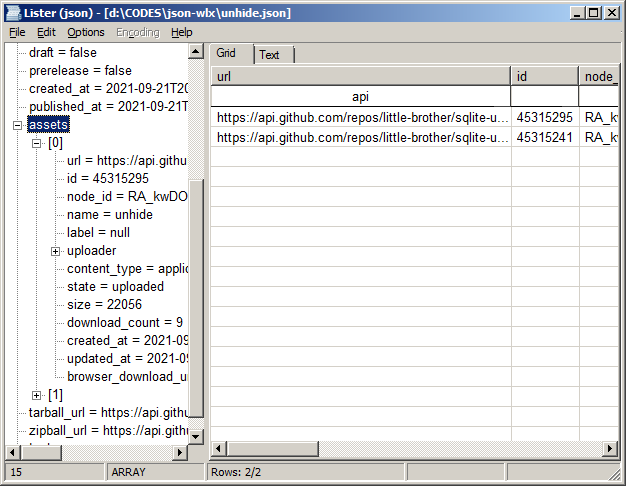

**jsontab** is a [Total Commander](https://www.ghisler.com/) plugin to view Json files.

|[**Download the latest version**](https://github.com/little-brother/jsontab-wlx/releases/latest/download/jsontab.zip)|
|-------------------------------------------------------------------------------------------|

### Features
* Mixed tree and grid view
* Column filters
* Sort data by column click
* Beautifier and highlighting
* Supports ANSI, UTF8 and UTF16

If you have any problems, comments or suggestions, check [Wiki](https://github.com/little-brother/jsontab-wlx/wiki), create [issue](https://github.com/little-brother/jsontab-wlx/issues) or just let me know <a href="mailto:lb.im@ya.ru?subject=jsontab-wlx">lb.im@ya.ru</a>.